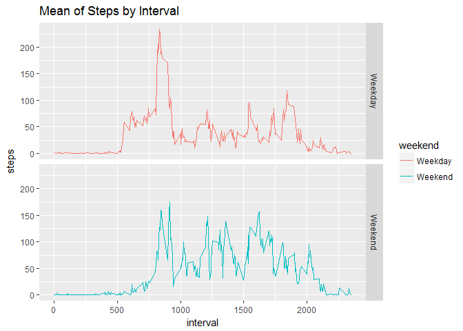

# Reproducible Research : Peer Assignment 1

## Loading and Processing the Data  
To load the data I use the read.csv() command.
1.Code for reading in the dataset and/or processing the data

```r
setwd("C:/Coursera/R/ReprodResearch")

activityData <- read.csv("activity.csv")
```

To see what the data look like, I use the str(), summary(), and head() commands:  


```r
str(activityData)
```

```
## 'data.frame':	17568 obs. of  3 variables:
##  $ steps   : int  NA NA NA NA NA NA NA NA NA NA ...
##  $ date    : Factor w/ 61 levels "2012-10-01","2012-10-02",..: 1 1 1 1 1 1 1 1 1 1 ...
##  $ interval: int  0 5 10 15 20 25 30 35 40 45 ...
```

```r
summary(activityData)
```

```
##      steps                date          interval     
##  Min.   :  0.00   2012-10-01:  288   Min.   :   0.0  
##  1st Qu.:  0.00   2012-10-02:  288   1st Qu.: 588.8  
##  Median :  0.00   2012-10-03:  288   Median :1177.5  
##  Mean   : 37.38   2012-10-04:  288   Mean   :1177.5  
##  3rd Qu.: 12.00   2012-10-05:  288   3rd Qu.:1766.2  
##  Max.   :806.00   2012-10-06:  288   Max.   :2355.0  
##  NA's   :2304     (Other)   :15840
```

```r
head(activityData)
```

```
##   steps       date interval
## 1    NA 2012-10-01        0
## 2    NA 2012-10-01        5
## 3    NA 2012-10-01       10
## 4    NA 2012-10-01       15
## 5    NA 2012-10-01       20
## 6    NA 2012-10-01       25
```

Modify the Date String to Date class and Remove the missing values and create a new data set. 


```r
# change date type to date class 
activityData$date <- as.Date(as.character(activityData$date))
# create NA dataset
activityDataNA <- is.na(activityData$steps)
finalActivityData <- activityData[!activityDataNA,]
head(finalActivityData)
```

```
##     steps       date interval
## 289     0 2012-10-02        0
## 290     0 2012-10-02        5
## 291     0 2012-10-02       10
## 292     0 2012-10-02       15
## 293     0 2012-10-02       20
## 294     0 2012-10-02       25
```

Calculate the total number of steps taken per day

```r
acivityByDaySum <- aggregate(finalActivityData$steps, by=list(finalActivityData$date),sum)
names(acivityByDaySum)[1] = "date"
names(acivityByDaySum)[2] = "totalsteps"
head(acivityByDaySum,10)
```

```
##          date totalsteps
## 1  2012-10-02        126
## 2  2012-10-03      11352
## 3  2012-10-04      12116
## 4  2012-10-05      13294
## 5  2012-10-06      15420
## 6  2012-10-07      11015
## 7  2012-10-09      12811
## 8  2012-10-10       9900
## 9  2012-10-11      10304
## 10 2012-10-12      17382
```

2.Histogram of the total number of steps taken each day


```r
# plot using ggplot
library(ggplot2)
ggplot(acivityByDaySum, aes(x=totalsteps)) +
      geom_histogram(fill="steelblue",  bindwidth=1000) + 
      labs(title="Total Daily Steps", x="Steps", y="Frequency")
```

```
## Warning: Ignoring unknown parameters: bindwidth
```

```
## `stat_bin()` using `bins = 30`. Pick better value with `binwidth`.
```

<!-- -->

3.Mean and median number of steps taken each day

```r
mean(acivityByDaySum$totalsteps)
```

```
## [1] 10766.19
```

```r
median(acivityByDaySum$totalsteps)
```

```
## [1] 10765
```

## Average daily activity pattern
4.Time series plot of the 5 minutes interval and the average number of steps taken


```r
# subset by interval
meanDataByInterval <- aggregate(finalActivityData$steps, by=list(finalActivityData$interval), mean)
# set the column names
names(meanDataByInterval)[1]="interval"
names(meanDataByInterval)[2]="steps"
ggplot(meanDataByInterval, aes(x=interval, y=steps))+
  labs(title = "Sum of the Steps by Interval", x="interval", y="steps")+
  geom_line(color="red")
```

<!-- -->

5.The 5-minute interval, on average across all the days that contains the maximum number of steps


```r
maxIntervalSteps <- meanDataByInterval[which.max(meanDataByInterval$steps),]
maxIntervalSteps
```

```
##     interval    steps
## 104      835 206.1698
```
6.Calculate and report the total number of missing values in the dataset (i.e. the total number of rows with NAs)


```r
missingValues <- sum(activityDataNA)
missingValues
```

```
## [1] 2304
```
7. Make a histogram of the total number of steps taken each day after missing values are imputed


```r
# new dataset with NA values
activityData2 <- activityData
# Remove NA values
cleanDataSet <- activityData2[!is.na(activityData2),]
 
# Date wise sum data
summedActivityByDay <- aggregate(cleanDataSet$steps, by = list(cleanDataSet$date),sum)
names(summedActivityByDay)[1]="date"
names(summedActivityByDay)[2]="totalsteps"
## Create Histogram using ggplot2
ggplot(summedActivityByDay, aes(x=totalsteps))+
  geom_histogram(fill="steelblue", binwidth=1000) +
  labs(title="Total Daily Steps", x="Steps", y= "Frequency")
```

<!-- -->
8. Differences in activity patterns between weekdays and weekends. 

```r
baseData2 <- cleanDataSet
baseData2$weekday <- weekdays(baseData2$date)
baseData2$weekend <- ifelse (baseData2$weekday == "Saturday" | baseData2$weekday == "Sunday", "Weekend", "Weekday")

MeanDataWeekendWeekday <- aggregate(baseData2$steps, by=list(baseData2$weekend, baseData2$interval), mean)
names(MeanDataWeekendWeekday)[1] ="weekend"
names(MeanDataWeekendWeekday)[2] ="interval"
names(MeanDataWeekendWeekday)[3] ="steps"
#head(MeanDataWeekendWeekday,10)
ggplot(MeanDataWeekendWeekday, aes(x = interval, y=steps, color=weekend)) +
  geom_line() +
  facet_grid(weekend ~ .) +
  labs(title = "Mean of Steps by Interval", x = "interval", y = "steps")  
```

<!-- -->

There seems to be an overall slightly larger incidence of steps during the weekends.  
